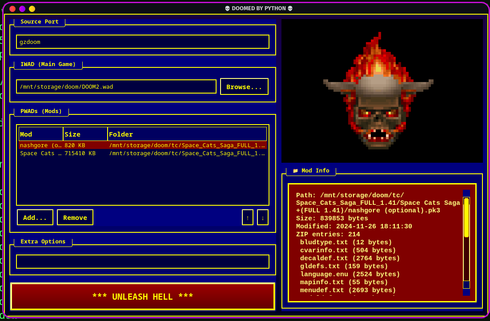

# 💀 DOOMED BY PYTHON 💀



> **THE ULTIMATE GZDOOM LAUNCHER**  
> _BORN OF HACKS. FORGED IN PYTHON. DESIGNED FOR THE TERMINAL-OBSESSED._  
>  
> _Written by Ericson Willians — Survivor of countless segmentation faults and WAD corruption events._

---

## 🔥 "ABANDON ALL HOPE, YE WHO RUN THIS LAUNCHER" 🔥

Welcome, mortal.  
You stand at the gateway to **DOOMED BY PYTHON**—a launcher so retro, so blue, so absolutely *cursed* that even your config files might burst into flames.

No more batch files. No more hand-editing command lines.  
Just a *searing*, 90s BBS-inspired interface for GZDoom. Complete with a floating lost soul, ANSI colors, and real modder suffering.

---

## 🪓 FEATURES STRAIGHT OUTTA ID SOFTWARE

| **HELLISH FEATURE**         | **WHAT IT DOES**                                         |
|----------------------------|----------------------------------------------------------|
| IWAD Selector              | Choose your fate: DOOM, DOOM II, or some eldritch WAD    |
| PWAD Stack                 | Load ‘em up—slaughter your mods in any order             |
| Launch Option Memory       | Your last rituals are remembered for next time           |
| Live Log Window            | See GZDoom’s innermost secrets scroll by in real time    |
| Mod Info Panel             | View mod sizes, file dates, and what you’re actually loading |
| Animated Lost Soul         | A GIF demon taunts you, just like a 1994 CD-ROM shareware |
| ANSI/CRT Visuals           | Blue backgrounds, yellow text, the full 90s DOS treatment|
| Progress & Busy Cursor     | Loading big mods? Wait in terror, just like the old days |

---

## 📸 SCREENSHOT


---

## 🚀 HOW TO RUN (INSTALL AT YOUR OWN RISK)

```bash
git clone https://github.com/yourname/doomed-by-python.git
cd doomed-by-python
pip install -r requirements.txt
python main.py
