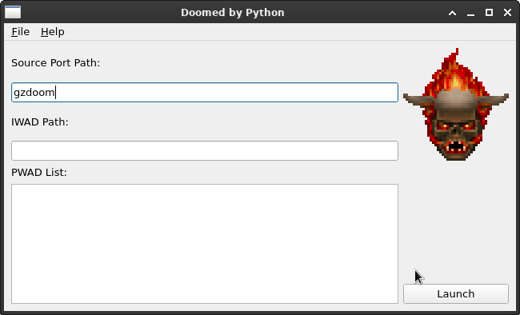

# Doomed by Python: Advanced GZDoom/Zandronum Mod Launcher

Doomed by Python is a sophisticated and efficient mod launcher designed for GZDoom and Zandronum players, with a particular emphasis on enhancing the experience for Linux users.

## Key Features

- **IWAD Chooser:** Seamlessly select the desired IWAD for your gaming session.
- **Multiple PWAD Selection:** Effortlessly add multiple PWADs to your game, expanding your gameplay options.
- **Launch Options Persistence:** Save your previously selected launch options in a JSON file for quick and easy future access.
- **Real-Time Log Window:** View GZDoom output in a separate window for easier debugging.
- **Detailed Mod Info:** Selecting a PWAD displays its contents, size, and modification time.
- **Hellish Visuals:** Fiery blue terminal theme with an animated lost soul GIF.
- **Loading Feedback:** Progress dialog and busy cursor appear while large mods are processed.

| **Feature** | **Summary** |
|-------------|-------------|
| **IWAD Chooser** | Select the desired IWAD before launching |
| **Multiple PWAD Selection** | Add several PWADs at once |
| **Launch Options Persistence** | Save and restore your command-line settings |
| **Real-Time Log Window** | Watch GZDoom output for debugging |
| **Detailed Mod Info** | Inspect PWAD contents, size, and timestamps |
| **Hellish Visuals** | Retro terminal theme with an animated lost soul |
| **Loading Feedback** | Busy cursor and progress dialog while mods load |

## Planned Enhancements

- **GZDoom Command-Line Parameters:** Full integration with GZDoom's command-line parameters, enabling advanced customization and control.
- **Deutex Wrapper Integration:** Considering the addition of a Deutex wrapper in lieu of the original WAD finder concept.
- **Windows Support:** Expand platform compatibility by adding support for Windows operating systems.
- **Additional Features:** Exploration of other potential improvements and additions based on user feedback and requirements.
